# Authentication and Authorization

## 1. Analysis

### 1.1. Use Case Diagram

Shows that the system handles the login, logout, password change, and ensuring an authenticated user.

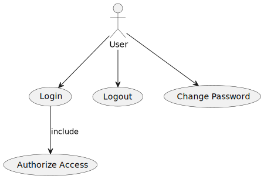

### 1.2. Domain Model

Defines the main entities related to authentication and authorization.

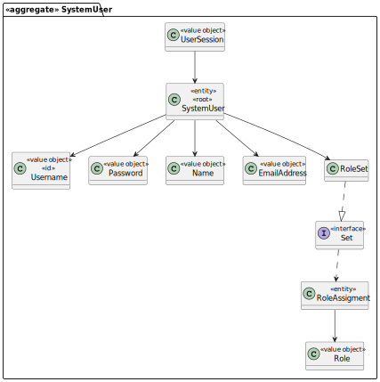

### 1.3. Sequence System Diagrams (SSD)

The SSDs represent the high-level interactions between the **User** (actor) and the **System**, focusing on the
messages exchanged without detailing internal components.

**Login:** Interaction showing how a user requests to login.

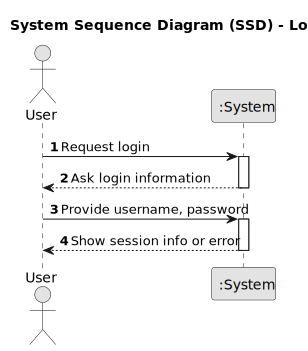

**Logout:** Interaction showing how a user initiates logout.

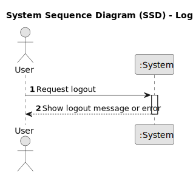

**Change Password:** Interaction showing how a user changes their password.

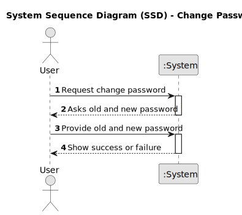

## 2. Design

### 2.1. Class Diagram (CD)

The following class diagrams define the structure and responsibilities of the classes involved in the use cases.
They represent the internal static design of the authentication and authorization functionalities.

**Login:** Class structure responsible for handling user authentication.

  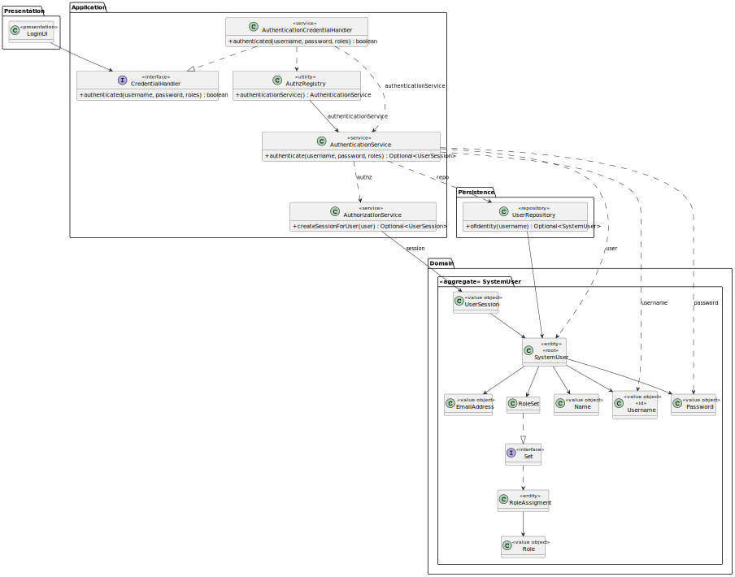

**Logout:** Class structure responsible for ending user sessions.

  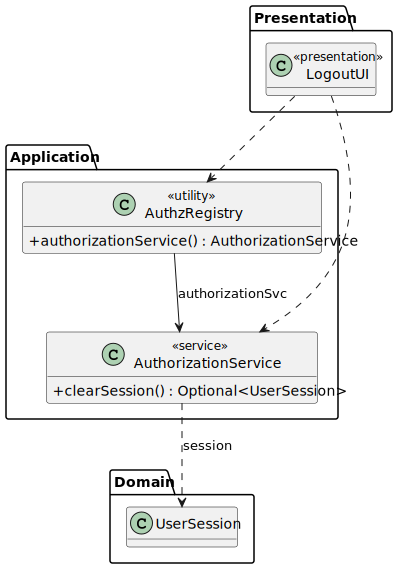

**Change Password:** Class structure responsible for validating and updating user passwords.

  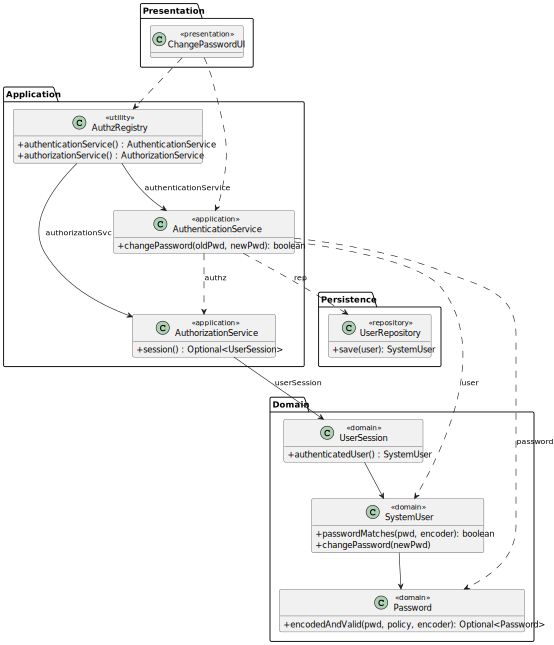

**Ensure Authenticated User:** Class structure responsible for checking and enforcing user authentication roles.

  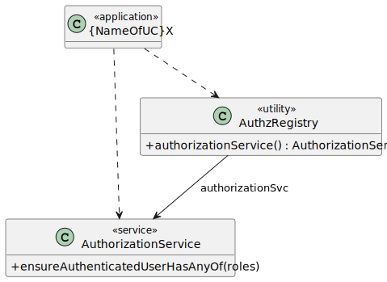

### 2.2. Sequence Diagram (SD)

The SDs present the detailed dynamic behavior of the system during the execution of each use case. Unlike SSDs,
they include the internal interactions between system components or objects.

**Login:** How the system authenticates a user.

  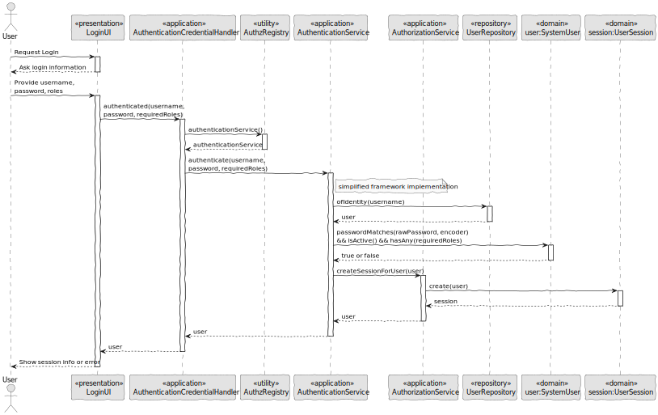

**Logout:** How the system logs out a user.

  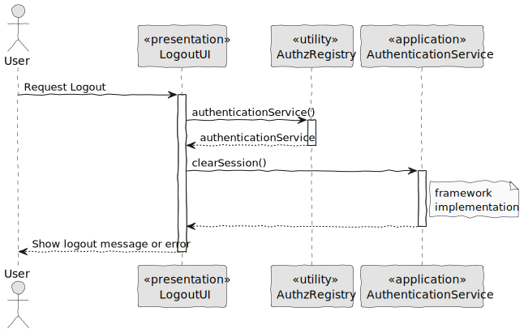

**Change Password:** How the system handles changing a user's password.

  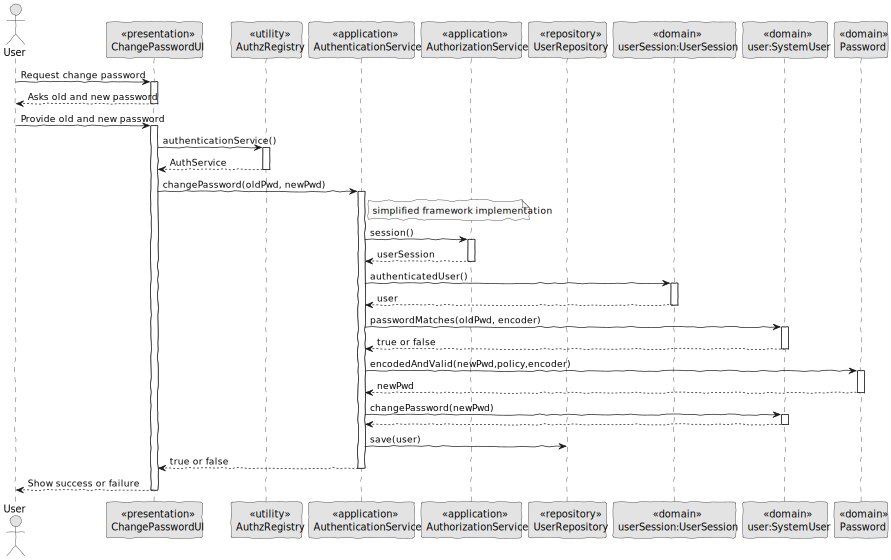

**Ensure Authenticated User:** How the system ensures that a user is authenticated before allowing access to protected resources.

  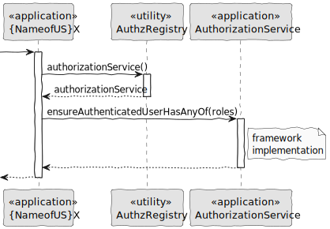

### 2.3. Applied Patterns

- MVC (Model-View-Controller): Separates user interface, application logic, and domain model.
- Repository Pattern: Used to abstract persistence logic in CafeteriaUserRepository.
- Domain-Driven Design (DDD): Aggregates like CafeteriaUser ensure consistency and encapsulate business rules.
- Authorization Check: Applied before critical operations through AuthorizationService.