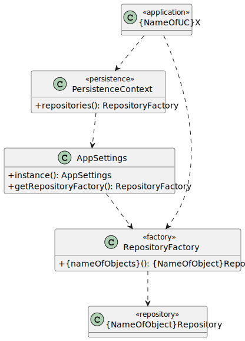
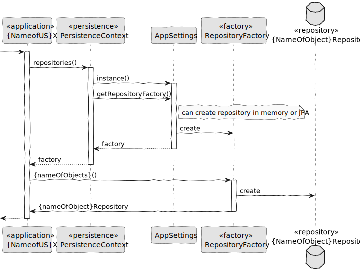

# Persistence

## 1. Requirements

The persistence module is responsible for managing the application's data repositories. It must support two implementations:

- **In-memory repositories**: Mainly used for development and testing.
- **Relational database repositories (JPA)**: Used in production.

The decision on which implementation to use is based on a property defined in a configuration file (**application.properties**).
This promotes flexibility and decouples the application from a specific storage strategy.

## 2. Design

The persistence layer is designed to be modular and extensible, making use of factory and strategy design patterns to
dynamically create the appropriate repository implementation.

### 2.1. Class Diagram

### 2.1. Sequence Diagram

