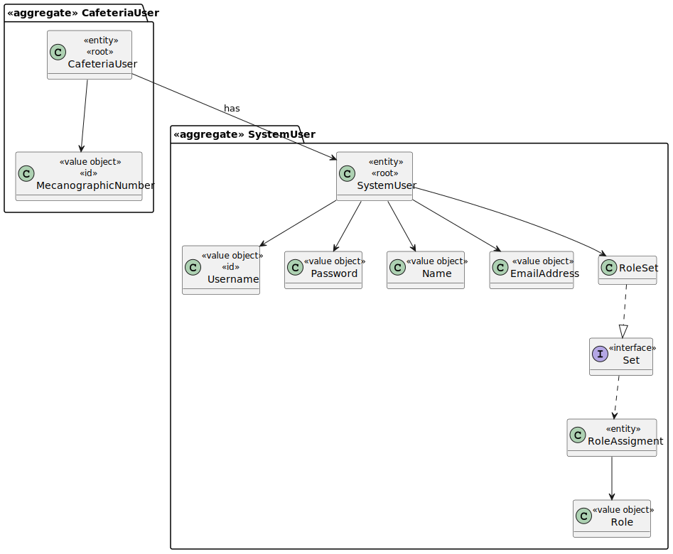
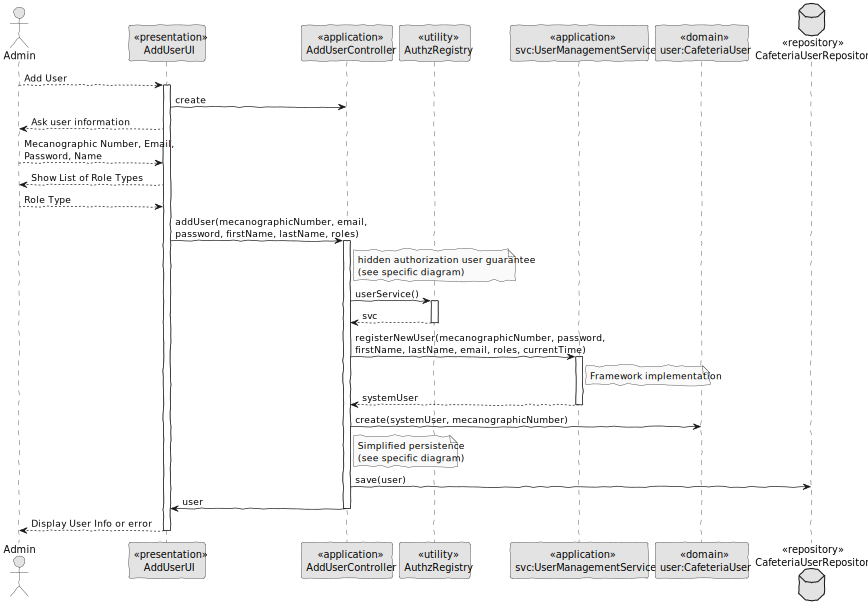

# US004 – Add User

### 1. Context

**As an administrator, I want to create new user accounts, so that new members can access the system.**

### 2. Analysis

**Domain Model:**

### 3. Design

**Sequence Diagram (SD):**

  

### 4. Integration/Demonstration

- To test the bootstrap process, simply run the script: *./run-bootstrap*
- To manually register a user, you must run the script *./run-backoffice*, log in with a user who is an Administrator,
and click on the Register User option.
