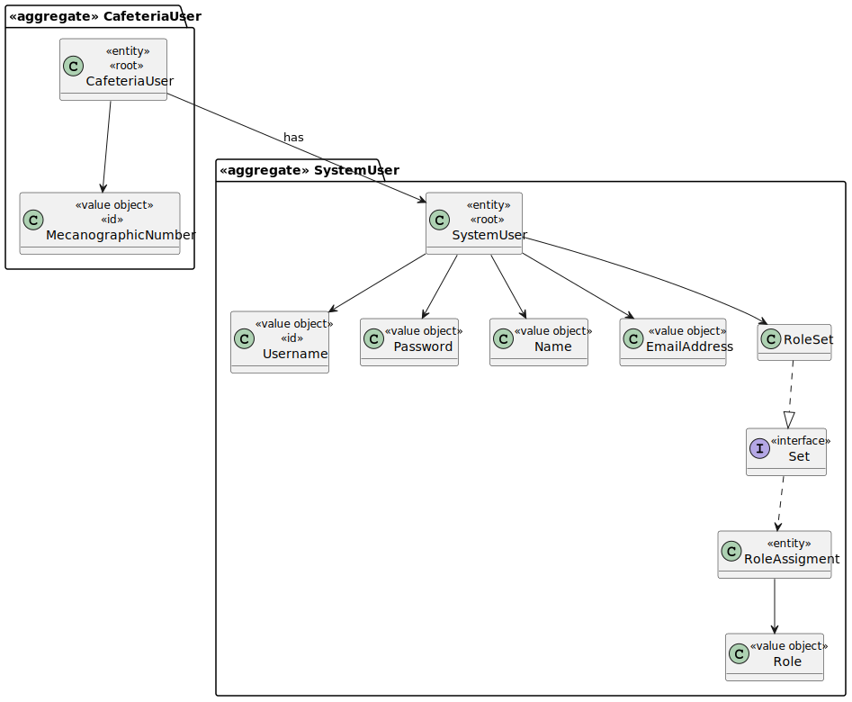
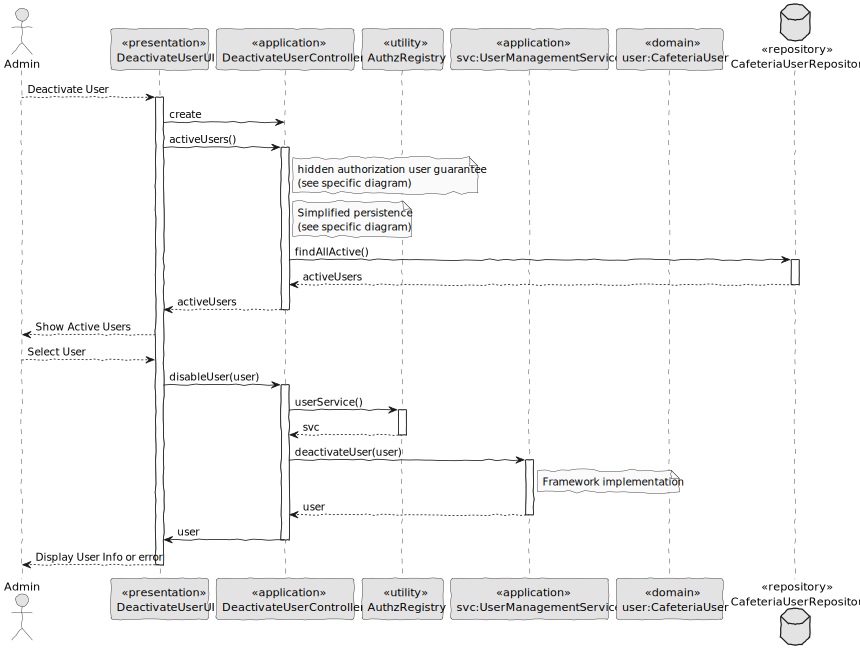

# US005 – Deactivate User

### 1. Context

**As an administrator, I want to deactivate a user account, so that I can restrict access in cases of inactivity, departure, or misuse.**

### 2. Analysis

**Domain Model:**

### 3. Design

**Sequence Diagram (SD):**

  

