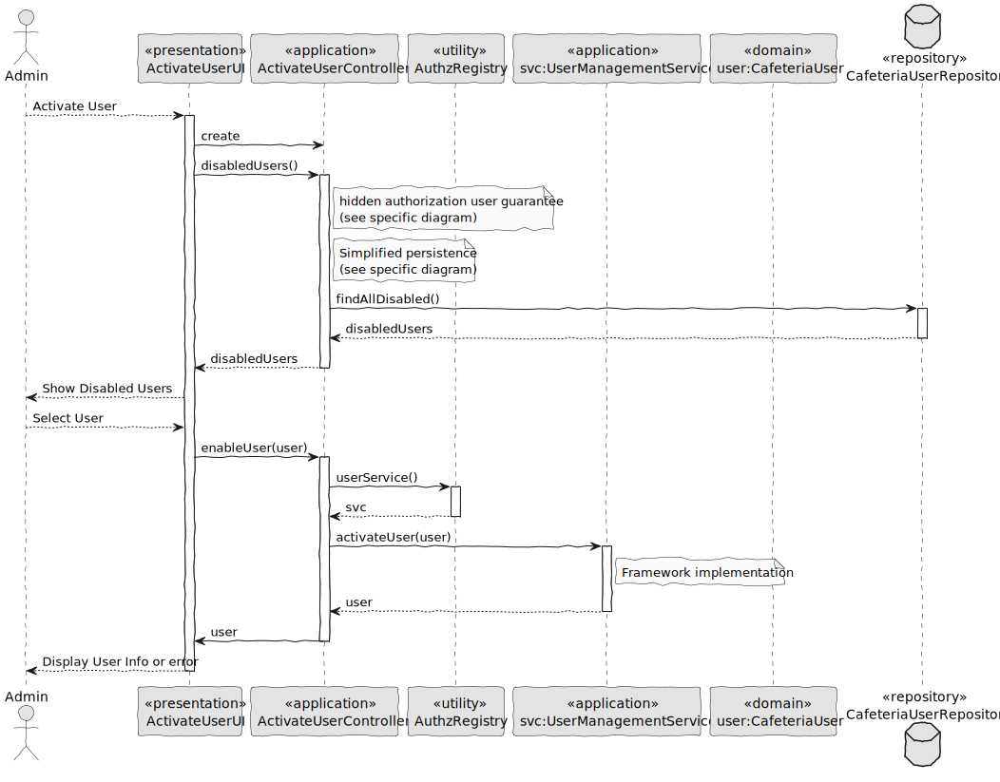

# US006 – Activate User

### 1. Context

**As an administrator, I want to reactivate a user account, so that a previously deactivated user can regain access to the system.**

### 2. Analysis

**Domain Model:**

### 3. Design

**Sequence Diagram (SD):**

  

### 4. Integration/Demonstration

- To test the bootstrap process, simply run the script: *./run-bootstrap*
- To manually activate user, you must run the script *./run-backoffice*, log in with a user who is an Admin,
  and click on the Activate User option.