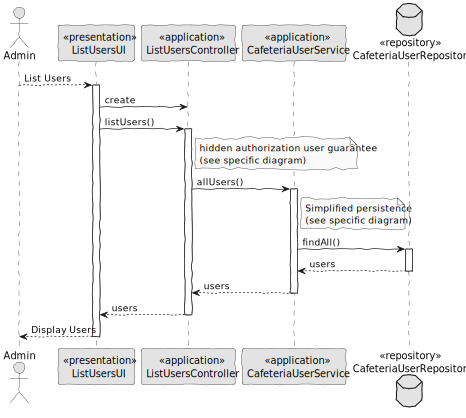

# US007 - List Users

### 1. Context

**As an administrator, I want to view a list of all user accounts, so that I can manage and monitor system access.**

### 2. Analysis

**Domain Model:**

### 3. Design

**Sequence Diagram (SD):**

  

### 4. Integration/Demonstration

- To test the bootstrap process, simply run the script: *./run-bootstrap*
- To manually list users, you must run the script *./run-backoffice*, log in with a user who is an Admin,
  and click on the List Users option.
