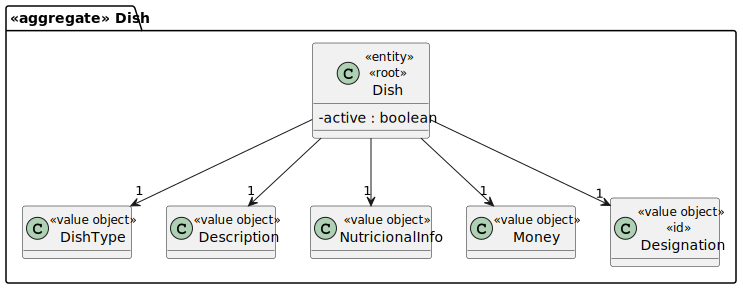
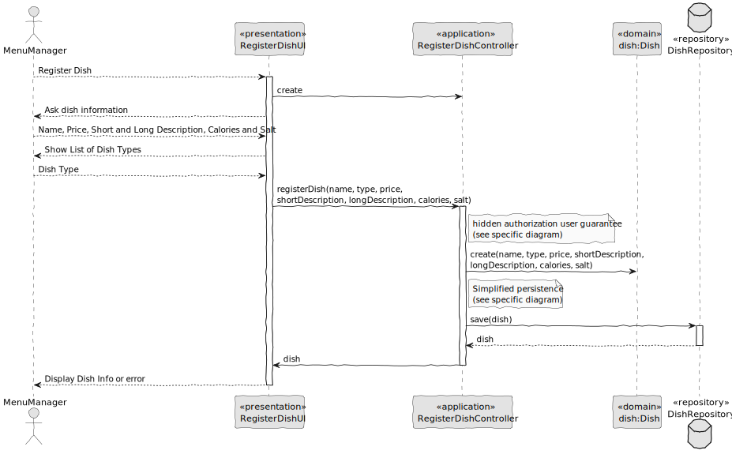

# US008 – Register Dish

### 1. Context

**As a menu manager, I want to register a new dish, so that it becomes available in the system.**

### 2. Analysis

**Domain Model:**

### 3. Design

**Sequence Diagram (SD):**

  

### 4. Integration/Demonstration

- To test the bootstrap process, simply run the script: *./run-bootstrap*
- To manually register a dish, you must run the script *./run-backoffice*, log in with a user who is an Menu Manager,
and click on the Register Dish option.
