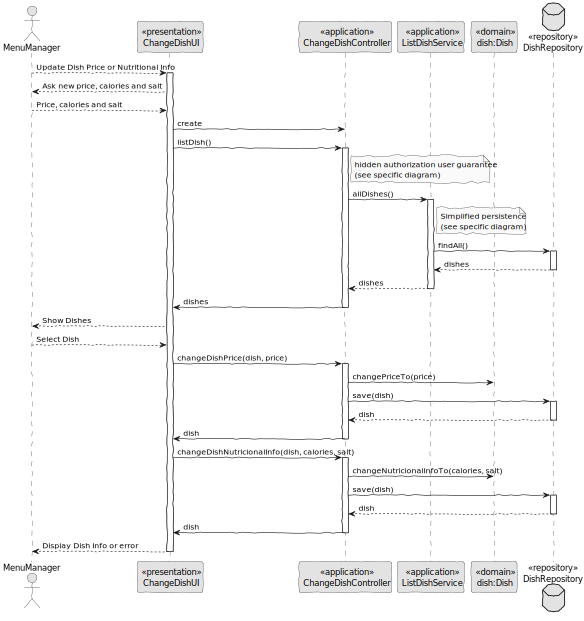

# US010 - Update Dish Price or Nutritional Info

### 1. Context

**As a menu manager, I want to update the price or nutritional information of a dish, so that users have accurate details.**

### 2. Analysis

**Domain Model:**

### 3. Design

**Sequence Diagram (SD):**

  

### 4. Integration/Demonstration

- To test the bootstrap process, simply run the script: *./run-bootstrap*
- To manually update dish price and nutricional info, you must run the script *./run-backoffice*, log in with a user who is an Menu Manager,
and click on the Change Dish.
