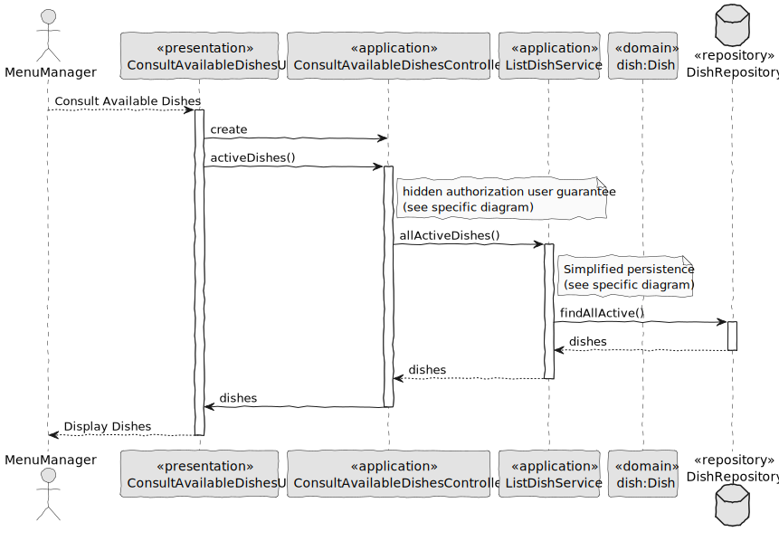

# US011 - Consult Available Dishes

### 1. Context

**As a menu manager, I want to be able to view all available dishes or filter them by type to better manage the menu.**

### 2. Analysis

**Domain Model:**

### 3. Design

**Sequence Diagram (SD):**

  

### 4. Integration/Demonstration

- To test the bootstrap process, simply run the script: *./run-bootstrap*
- To manually consult available dishes, you must run the script *./run-backoffice*, log in with a user who is an Menu Manager,
and click on the Consult Available Dishes option.
