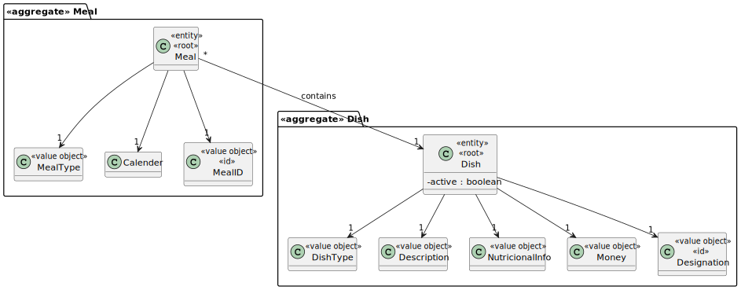
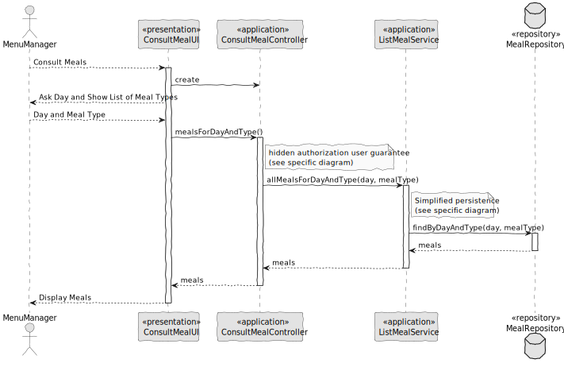

# US013 - Consult Meals

### 1. Context

**As a menu manager or cafeteria user, I want to view meals by day, period, or type, so that I can either manage the menu or choose what to consume.**

### 2. Analysis

**Domain Model:**

### 3. Design

**Sequence Diagram (SD):**

  

### 4. Integration/Demonstration

- To test the bootstrap process, simply run the script: *./run-bootstrap*
- To manually consult meals, you must run the script *./run-backoffice*, log in with a user who is an Menu Manager or Cafeteria User,
and click on the Consult Meals option.
