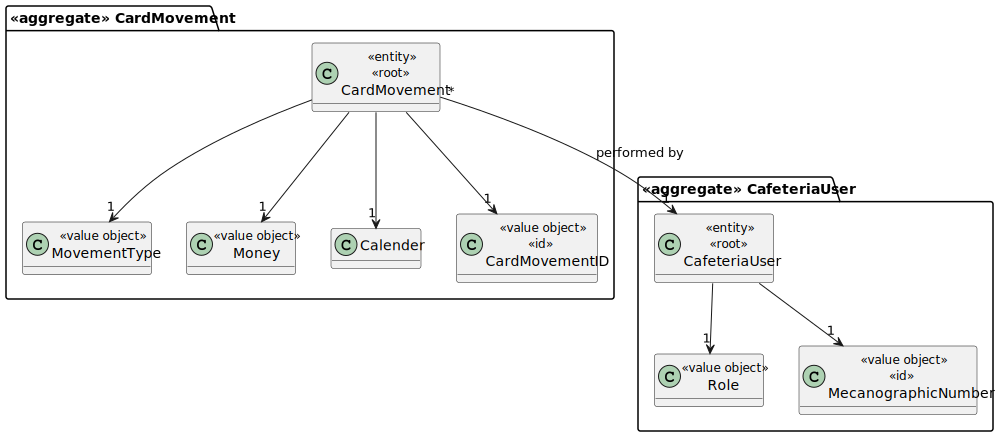
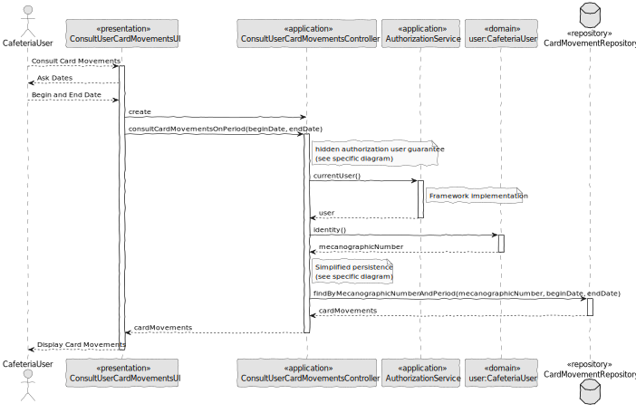

# US015 - Consult Card Movements

### 1. Context

**As a cafeteria user, I want to consult all my transactions or filter them by period, so that I can track my expenses.**

### 2. Analysis

**Domain Model:**

### 3. Design

**Sequence Diagram (SD):**

  

### 4. Integration/Demonstration

- To test the bootstrap process, simply run the script: *./run-bootstrap*
- To manually consult user movements, you must run the script *./run-backoffice*, log in with a user who is an Cafeteria User,
and click on the Consult User Card Movements option.
