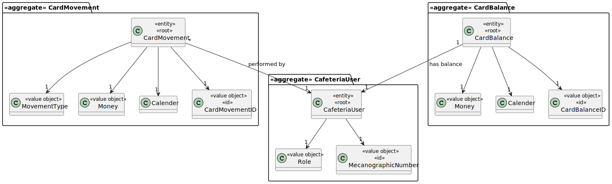
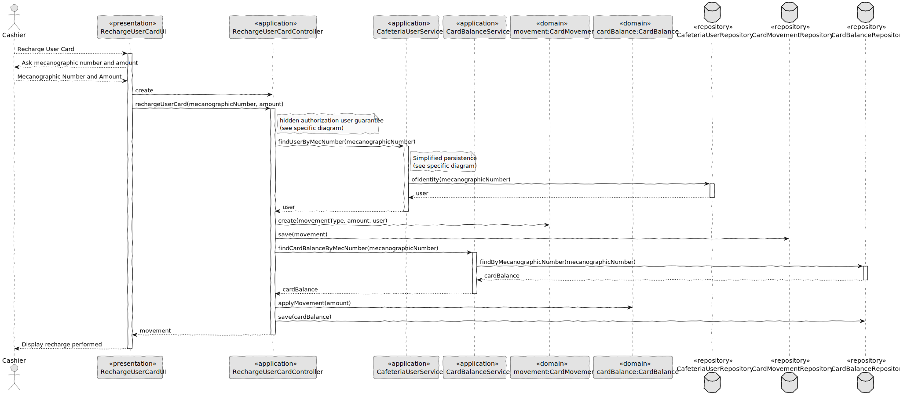

# US016 - Recharge User Card

### 1. Context

**As a cashier, I want to recharge a user’s card, so that they can continue to make reservations.**

### 2. Analysis

**Domain Model:**

### 3. Design

**Sequence Diagram (SD):**

  

### 4. Integration/Demonstration

- To test the bootstrap process, simply run the script: *./run-bootstrap*
- To manually recharge user card, you must run the script *./run-backoffice*, log in with a user who is an Cashier,
and click on the Recharge User Card option.
