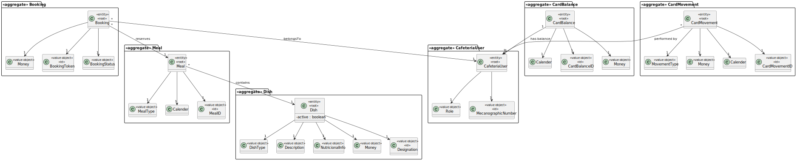

# US017 - Book a Meal

### 1. Context

**As a cafeteria user, I want to book a meal, so that I can secure a meal in advance.**

### 2. Analysis

**Domain Model:**

### 3. Design

**Sequence Diagram (SD):**

  

### 4. Integration/Demonstration

- To test the bootstrap process, simply run the script: *./run-bootstrap*
- To manually book a meal, you must run the script *./run-backoffice*, log in with a user who is an Cafeteria User,
and click on the Book a Meal.
