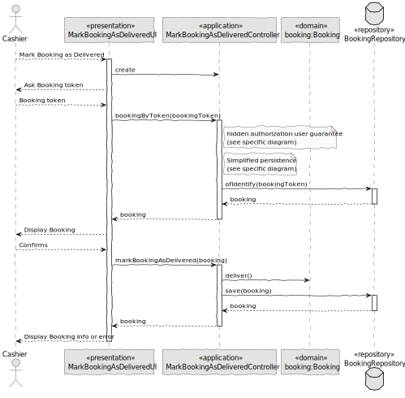

# US020 - Mark Booking as Delivered

### 1. Context

**As a cashier, I want to mark a booking as delivered, so that the system reflects completed transactions.**

### 2. Analysis

**Domain Model:**

### 3. Design

**Sequence Diagram (SD):**

  

### 4. Integration/Demonstration

- To test the bootstrap process, simply run the script: *./run-bootstrap*
- To manually mark booking as delivered, you must run the script *./run-backoffice*, log in with a user who is an Cashier,
and click on the Mark Booking as Delivered.
