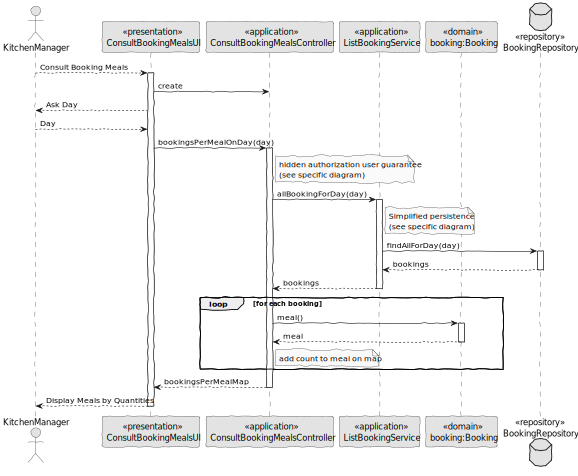

# US021 - Consult Booking Meals

### 1. Context

**As a kitchen manager, I want to consult reserved meals and their respective quantities, so that I can plan meal preparation.**

### 2. Analysis

**Domain Model:**

### 3. Design

**Sequence Diagram (SD):**

  

### 4. Integration/Demonstration

- To test the bootstrap process, simply run the script: *./run-bootstrap*
- To manually consult reserved meals, you must run the script *./run-backoffice*, log in with a user who is an Kitchen Manager,
and click on the Consult Booking Meals.
